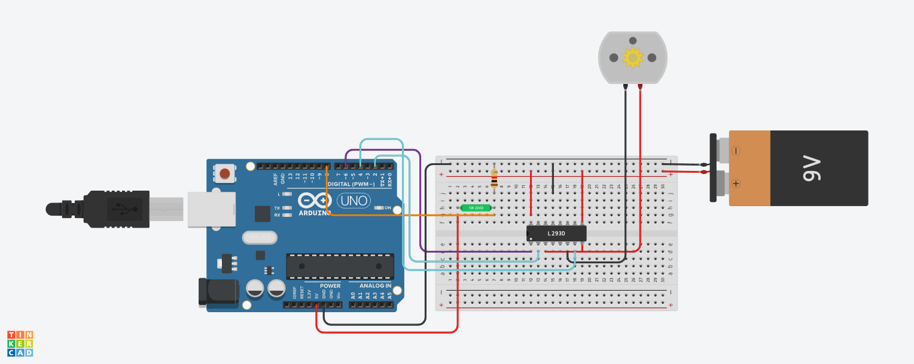

# Arduino Tilt Sensor Motor Control Project

This is an Arduino project that uses a tilt sensor and a motor to create a simple tilt-based control system. The project is designed to help beginners get started with Arduino and electronics.

## Materials

To complete this project, you will need:

- Arduino Uno board
- Breadboard
- Tilt sensor
- Motor (any DC motor)
- Motor driver 
- Jumper wires
- USB cable (for programming the Arduino)

## Wiring

The wiring diagram for the project is as follows: 

## Code

The code for the project is written in the Arduino IDE. It reads the digital input from the tilt sensor and controls the motor using the motor driver. When the tilt sensor detects any tilt, the motor is turned on and moves in a specific direction.

## Usage

To use the project, simply upload the code to your Arduino Uno board and connect the circuit as described above. When you tilt the sensor, the motor will move in the specified direction.

## Tinkercad
- You can view a live simulaton of the project through the following link on [Tinkercad](https://www.tinkercad.com/things/gbYevLSdVN8-tilt-sensor)

## Credits

This project was inspired by [this tutorial on Tilt Sensors ↗](https://create.arduino.cc/projecthub/Anas20/tilt-sensor-f1921f) from Arduino Project Hub.
